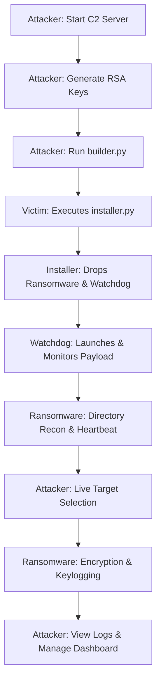

# Cerberus Ransomware Simulation 🐕🔥

> **⚠️ DISCLAIMER: FOR EDUCATIONAL AND RESEARCH PURPOSES ONLY.**
> **DO NOT USE ON UNAUTHORIZED SYSTEMS.**
> This project is a sophisticated malware simulation designed for academic research in System Security. It demonstrates advanced concepts including **Hybrid Cryptography**, **C2 Infrastructure**, **Anti-Forensics**, and **Human-Operated Targeting**. The author takes no responsibility for misuse.

---

## 📖 Overview

**Cerberus** is a sophisticated, end-to-end ransomware simulation framework. It demonstrates the lifecycle of a modern cyber-attack, from the initial delivery via a "Trojaned" installer to persistent system lockdown and remote command-and-control (C2) management.

### What is it?
A full-stack implementation of a ransomware attack:
- **Attacker Side**: A Flask-based C2 Server with a live dashboard and RSA-based decryption management.
- **Victim Side**: A multi-stage payload featuring a fake NVIDIA installer, a watchdog monitor, and a high-security encryption engine.

---

## 🏗️ Technical Architecture

The project is structured into two main workspaces: `attacker` and `victim`.

### 1. The Infection Lifecycle

### ⚔️ Attack Lifecycle

1.  **Infiltration**: The victim executes `installer.py`. A fake NVIDIA progress bar masks the silent extraction of the Ransomware and Watchdog payloads to `%APPDATA%` or `~/.config`.
2.  **Persistence**: The Watchdog process is established as a startup service, ensuring the ransomware survives reboots and manual termination.
3.  **Reconnaissance**: The malware performs a **Directory Recon** of the victim's home directory. It beacons this structure to the C2 Server and enters a waiting state.
4.  **Target Selection**: The Attacker browses the victim's folders via the dashboard and manually selects target directories (e.g., `Documents`, `Pictures`) for encryption.
5.  **Impact**: Upon receiving the command, the payload executes **AES-256-GCM** encryption across selected targets and immediately performs **Secure File Shredding** on the original data.
6.  **Extortion**: The Ransomware GUI locks the viewport, starts the **Doomsday Timer**, and begins streaming captured keystrokes to the Attacker in real-time.

### 2. Core Components

#### 🕵️ C2 Server (`attacker/c2_server.py`)
The "brain" of the operation.
- **Hybrid Key Management**: Generates **RSA-2048** keys to securely wrap and exfiltrate the victim's unique AES keys.
- **Human-Operated Targeting (Recon Mode)**: Victims **beacon** their home directory structure to the C2 without encrypting immediately. The attacker manually selects high-value targets via the [Target Selection UI](/target_selection).
- **Live Monitoring**: Track IP addresses, view captured keystrokes in real-time, and monitor the **Server-Side Doomsday Timer** (enforced centrally to prevent client-side tampering).

#### 📦 Stealth Dropper & Builder (`builder.py`)
- **Dynamic Configuration**: The builder patches the payload with your specific C2 IP, RSA Public Key, and a custom **Fallback Target Folder** before deployment.
- **Social Engineering**: The generated `installer.py` mimics a legitimate **NVIDIA GeForce Driver Update** with a convincing loading bar while silently installing the payload.

#### 🐕 Watchdog Persistence (`victim/watchdog.py`)
- **Resilience**: A separate monitoring process that instantly respawns the ransomware if terminated.
- **Cross-Platform Hooks**: Installs itself into `~/.config/autostart` (Linux) or **Registry Run Keys** (Windows) to maintain infection across reboots.

#### 💀 Advanced Payload (`victim/ransomware.py`)
- **Cryptography**: High-speed **AES-256-GCM** encryption for all files matching target extensions.
- **Anti-Forensics**: Implements **Secure File Shredding** (overwriting data with `os.urandom`) before deletion to prevent forensic file recovery.
- **Asynchronous Keylogger**: Captures all keystrokes in a background thread and streams them to the C2 via periodic flushes.
- **System Lockdown**:
    - **Focus Enforcement**: Forces the GUI to the top every 50ms.
    - **Input Blocking**: Disables system shortcuts (Alt+F4, Esc) and steals mouse focus.
    - **Watchdog Integration**: Automatically installs itself into system startup Registry/Paths.
- **Psychological Warfare**:
    - **Ragebait UI**: Trolls the user with mocking messages on exit attempts.
    - **Voice Synthesis (TTS)**: Announces threats ("System failure imminent") through the system speakers every 30 seconds.

---

## 🔐 Cryptography Deep-Dive

Cerberus follows industry standards for secure key exchange:

1.  **Preparation**: Attacker generates RSA-2048 keys.
2.  **Encryption**: On the victim machine, a random **256-bit AES key** is generated. All target files are encrypted using **AES-256-GCM** (authenticated encryption).
3.  **Key Transport**: The AES key is encrypted using the **Attacker's RSA Public Key**. Even if the victim discovers the encrypted key file, it cannot be decrypted without the Attacker's Private Key.
4.  **Decryption**: Once the C2 releases the key, the victim receives the AES key, validates it, and reverses the encryption process.

---

## 🚀 Setup & Usage

### Step 1: Start the C2 (Attacker)
Go to the `attacker/` directory, install dependencies, and run the server. Note the **Public Key** printed in the console.

### Step 2: Build the Dropper (Victim/Builder)
Run `builder.py`. It will ask for the C2 IP and automatically inject the Public Key into a new `installer.py` dropper.

### Step 3: Deployment
Execute `installer.py` on the target machine. Observe the fake installation progress followed by the system lockdown.

### Step 4: Management
Access the dashboard at `http://[C2_IP]:5000` to manage your victims and release keys.

---

## 🛡️ Defensive & Safety Measures

- **Logs**: If the payload fails, check the debug logs at:
    - **Linux**: `~/.config/cerberus/cerberus_log.txt`
    - **Windows**: `%APPDATA%\Cerberus\cerberus_log.txt`
- **Target Extensions**: Modify the `TARGET_EXTENSIONS` set in `ransomware.py` to target specific types (e.g., source code, databases).
- **Safety**: The "Watchdog" is configured with a safety stop signal to ensure a clean exit after successful decryption.

---

*Made with 🧠 for Cybersecurity Professionals and Students.*
